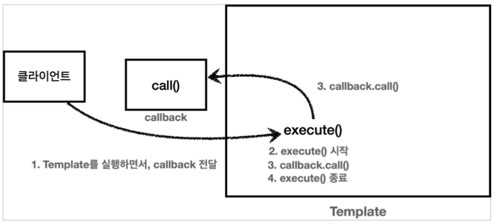

# 콜백 패턴 CallBack Pattern
기존에 전략 패턴에서 매개변수를 통해 전략을 넘겨주는 방식을 알아 보았다.<br>
이를 콜백 패턴이라고 한다.

> ### 콜백 정의
> 콜백, 콜애프터 함수 라고 하며 다른 코드의 인수로서 넘겨주는 실행 가능한 코드를 말한다.
> 콜백을 넘겨받는 코드는 이 콜백을 필요에 따라 즉시 실행 할 수도 나중에 실행 할 수도 있다.

## java 에서의 실행가능한 코드(함수) 넘겨주기
java 에서는 코드를 인수로 넘기려면 객체가 필요
1. 하나의 메소드를 가진 인터페이스를 구현하고 익명 내부 클래스를 통해 코드 넘기기
2. 람다를 사용한 코드 넘기기



🖥 template - callback
```java
@Slf4j
public class TimeLogTemplate {

    // 매개변수를 통한 주입,(분리)
    public void execute(Callback callback) {
        long startTime = System.currentTimeMillis();
        //비즈니스 로직 실행
        callback.call(); //위임
        //비즈니스 로직 종료
        long endTime = System.currentTimeMillis();
        long resultTime = endTime - startTime;
        log.info("resultTime={}", resultTime);
    }
}

public interface Callback {
    void call();
}

@Slf4j
public class TemplateCallbackTest {

    /**
     * 템플릿 콜백 패턴 - 익명 내부 클래스
     */
    @Test
    void callbackV1() {
        TimeLogTemplate template = new TimeLogTemplate();
        template.execute(new Callback() {
            @Override
            public void call() {
                log.info("비즈니스 로직1 실행");
            }
        });

        template.execute(new Callback() {
            @Override
            public void call() {
                log.info("비즈니스 로직2 실행");
            }
        });
    }

    /**
     * 템플릿 콜백 패턴 - 람다
     */
    @Test
    void callbackV2() {
        TimeLogTemplate template = new TimeLogTemplate();
        template.execute(() -> log.info("비즈니스 로직1 실행"));
        template.execute(() -> log.info("비즈니스 로직2 실행"));
    }

}
```

### 한계
하지만 여전히 실제 사용하는 로직에서는 부가기능에 대한 Context던, 템플릿이든 호출을 해야 부가기능을 
추가 할 수 있다. 다음 프록시를 이용한 디자인 패턴으로 한계를 극복해보자
