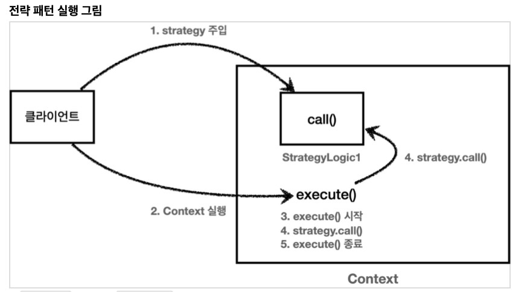

# 전략 패턴(Strategy Pattern)

## 템플릿 메서드 패턴의 해결
부모 클래스에서 부가 기능에 대한 알고리즘 방식을 정하고 (부가 기능 클래스들의 매서드 호출)<br>
핵심 기능 호출은 부모 클래스를 상속한 자식클래스에서 진행하여 해결

템플릿 메서드에서 parent - child 관계로 해결을 했다면 전략 패턴은 Context - Strategy 방식으로 해결한다.

## 전략 패턴


다음과 같이 Context 에 부가 기능에 대한 로직을 정리하고 Strategy 에 핵심기능에 대한 로직을 정리한다.<br>
부가 기능 - 핵심 기능 에 대한 분리가 상속관계로 분리를 하지 않고 필드를 통한 분리를 하여 상속의 단점을 없앤다

필드를 통한 분리의 코드는 다음과 같다.

🖥 Context
```java
public class Context {
    // 필드를 통한 분리
    // 상속과는 다르게 필드 주입을 위한 Config 가 필요하다.
    private Strategy strategy;
    
    public void execute {
        log.info("부가 기능 호출");
        strategy.call();
        log.info("부가 기능 호출");
    }
}

public interface Strategy {
    void call();
}

// 핵심 기능을 호출할 클래스
public class primaryStrategy extends Strategy {
    @Override
    public void call(){
        // "핵심 기능 호출";
    }
}
```

> ### 재밌는점 
> 실제로 이것은 spring 에서 사용했던 controller, service, repository 와 비슷하다.<br>
> 알게 모르게 전략 패턴을 사용했던 것이다.<br>
> 물론 실제로는 controller, service, repository 계층을 인터페이스로 돌리는 선택은 큰 규모가 아니면 
> 어려우니까... 실제로 나도 잘 몰랐다.

핵심은 interface 상속을 통해 Context는 특정 구현체에 의존하지 않으며 그로 인해 변경에 대해 유연하게 받아 드릴 수 있다.

각 3계층으로 분리를 해보았을 때 service - repository 관계에서 <br>
service는 Context에 대칭되고 repository는 Strategy 에 대칭된다.<br>
어찌보면 그래서 spring의 컨테이너를 ApplicationContext 라고 부르는 지도 모르겠다.<br>
Context들의 집합이니까!

위에서도 말했듯이 필드로 분리를 했으므로 별도의 Config 파일이 필요하다 하지만 spring은 DI를 통해 이런 일일이
Config 작성을 방지하고 개발자의 시간 낭비를 줄여주는 것 같다.

## 실행 순서


🖥 실 사용
```java
@Slf4j
public class ContextV1Test {
    @Test
    void strategyV1() {
        StrategyLogic1 strategyLogic1 = new StrategyLogic1();
        ContextV1 context1 = new ContextV1(strategyLogic1);
        context1.execute();

        StrategyLogic2 strategyLogic2 = new StrategyLogic2();
        ContextV1 context2 = new ContextV1(strategyLogic2);
        context2.execute();
    }

    @Test
    void strategyV2() {
        Strategy strategyLogic1 = new Strategy() {
            @Override
            public void call() {
                log.info("비즈니스 로직1 실행");
            }
        };
        ContextV1 context1 = new ContextV1(strategyLogic1);
        log.info("strategyLogic1={}", strategyLogic1.getClass());
        context1.execute();

        Strategy strategyLogic2 = new Strategy() {
            @Override
            public void call() {
                log.info("비즈니스 로직2 실행");
            }
        };
        ContextV1 context2 = new ContextV1(strategyLogic2);
        log.info("strategyLogic2={}", strategyLogic2.getClass());
        context2.execute();
    }

    @Test
    void strategyV3() {
        ContextV1 context1 = new ContextV1(new Strategy() {
            @Override
            public void call() {
                log.info("비즈니스 로직1 실행");
            }
        });
        context1.execute();

        ContextV1 context2 = new ContextV1(new Strategy() {
            @Override
            public void call() {
                log.info("비즈니스 로직2 실행");
            }
        });
        context2.execute();
    }

    @Test
    void strategyV4() {
        ContextV1 context1 = new ContextV1(() -> log.info("비즈니스 로직1 실행"));
        context1.execute();

        ContextV1 context2 = new ContextV1(() -> log.info("비즈니스 로직2 실행"));
        context2.execute();
    }
}
```

## 전략 패턴의 핵심
상속을 통한 분리에서 필드를 이용한 분리로 변경했다.<br>
필드로 주입을 하여 실행을 하기 때문에 선조립, 후 실행이라고 생각하면 된다.

단 이 방식은 조립 이후에는 절걍을 변경하기가 어려워진다. spring 어플리케이션에서 실시간으로 DB 환경을 바꾼다고 생각해봐도 
그렇다. 또한 Strategy 내부에서 상태를 가지고 있는 멤버 변수를 가지고 있을 경우 동시성 이슈 또한 고려 대상이다.<br>
추가적으로 이 Context를 대부분 싱글톤 방식으로 사용할 것인데 이를 통해 오는 제약이 많다

더 유연하게 대처하기 위해서는 2가지를 생각 해볼 수 있다.
1. Strategy는 그대로 매번 다른 Strategy 를 가지는 Context 새로 생성
2. Stragegy를 매개변수로 받아 드리기
3. 콜백 패턴의 사용

2번을 살펴 보자

🖥 매개변수로 넘기기
```java
@Slf4j
public class ContextV2 {

    public void execute(Strategy strategy) {
        long startTime = System.currentTimeMillis();
        //비즈니스 로직 실행
        strategy.call(); //위임
        //비즈니스 로직 종료
        long endTime = System.currentTimeMillis();
        long resultTime = endTime - startTime;
        log.info("resultTime={}", resultTime);
    }
}

@Slf4j
public class ContextV2Test {

    /**
     * 전략 패턴 적용
     */
    @Test
    void strategyV1() {
        ContextV2 context = new ContextV2();
        context.execute(new StrategyLogic1());
        context.execute(new StrategyLogic2());
    }

    /**
     * 전략 패턴 익명 내부 클래스
     */
    @Test
    void strategyV2() {
        ContextV2 context = new ContextV2();
        context.execute(new Strategy() {
            @Override
            public void call() {
                log.info("비즈니스 로직1 실행");
            }
        });
        context.execute(new Strategy() {
            @Override
            public void call() {
                log.info("비즈니스 로직2 실행");
            }
        });
    }

    /**
     * 전략 패턴 익명 내부 클래스2, 람다
     */
    @Test
    void strategyV3() {
        ContextV2 context = new ContextV2();
        context.execute(() -> log.info("비즈니스 로직1 실행"));
        context.execute(() -> log.info("비즈니스 로직2 실행"));
    }
}
```

## 정리
어플리케이션의 의존관계를 설정 할 때에는 선 조립, 후 실행이 좋다.<br>
하지만 의존관계를 끝내고 코드를 작성을 할 때는 매개변수로 전략을 넘기는 편이 좋다.

다음 으로 콜백 패턴을 사용해보자

