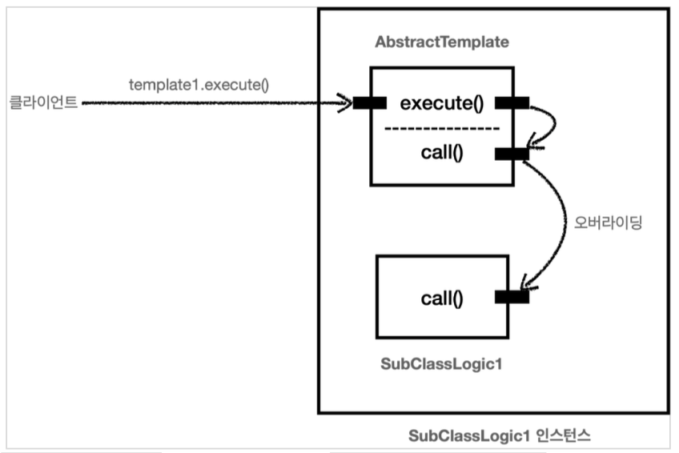

# 🤔 템플릿 메서드 패턴과 콜백 패턴
why?<br>
로그추적기를 예로 들어보고, 각 request에 대해서 어떤 메서드를 호출하는지 
시스템을 보고 싶다면 spring에 등록한 controller, service, repository 
계층에 log.info()를 남겨야 할 것이다.

결국 핵심 기능과 부가 기능이 엉키고 섥히는 현상이 나오게 될 것이다.

따라서 이러한 반복적인 공통 로직들에 대한 관리를 위해 디자인 패턴을 알아보자

## 🤣 정의
> 작업에서 알고리즘의 골격을 정의하고 일부 단계를 하위 클래스로 연기합니다. 템플릿 메서드를 사용하면 하위 클래스가
> 알고리즘의 구조를 변경하지 않고도 알고리즘의 특정 단계를 재정의 할 수 있습니다.

여기서 핵심은 특정 알고리즘 골격(추상 클래스), 하위 클래스(상속) 이다.<br>
추가적으로 중요하다고 생각하는 것은 부가기능의 구현과 핵심 기능의 구현은 따로 가져가고 골격에서 부가기능에 대한
메서드를 호출, 하위클래스에서 핵심기능에 대한 호출이 이루어져야 한다는 점이다.

곧 쉽게 변경이 되는 로직은 자식 클래스에 정의를 함으로서 상속과 오버라이딩을 통해서 변경을 최소화 할 수 있다.



나중에 데코레이터 패턴과 비슷하니 잘 알아두어야 겠다.

## 좋은 설계?
구현은 누구나 다 할 수있다. 하지만 깔끔하게 코드를 짜내는 것은 어렵다.<br>
단일 책임 원칙(SRP)를 지키는 코드가 좋은 코드이다.<br>
단일 책임 원칙을 지킬 경우 코드에 변경이 필요할 때 깔끔하게 한 곳만 변경해서
코드를 완성 시킬 수 있다.

## 템플릿 메서드 패턴

### 들어가기전...
1. 공통 로직 분석하기
2. 변하는 것과 변하지 않는 것을 분리하기
   * 단순하게 코드적으로 불변하는 것을 의미하는 것은 아니다.<br>
   핵심 기능(request 를 처리하는 로직)과 부가 기능(로그 추적기 같은 로직)
   을 분리하여 단순하게 반복되는 공통 기능을 분리해야 한다.

### 템플릿 메서드 패턴이란?
이름 그대로 템플릿을 사용하는 방식.<br>
부가 기능을 실행하는 추상클래스를 만들고 핵심 기능은 추상메서드로 남긴채 
그 추상메서드를 override 하여 핵심기능을 감싸는 방식이라고 이해하면 된다.

코드로 살펴보자

🖥 템플릿 매서드 패턴을 위한 추상클래스
```java
@Slf4j
public abstract class TemplateMethod{
    public void execute() {
        log.info("부가 기능 작성");
        call();
        log.info("부가 기능 작성");
    }
    
    public abstract void call();
} 
```

🖥 핵심기능을 끼워넣을 클래스 1
```java
@Slf4j
public class Class1 extends TemplateMethod {
    @Override
    public void call(){
        log.info("클래스1의 핵심 기능 실행");
    }
}
```

🖥 핵심기능을 끼워넣을 클래스 2
```java
@Slf4j
public class Class2 extends TemplateMethod {
    @Override
    public void call(){
        log.info("클래스2의 핵심 기능 실행");
    }
}
```

실제 사용은 그저 호출을 하기만 하면 된다.<br>
🖥 실제 사용
```java
@Test
public void templateMethodV1() {
    AbstractTemplate template1 = new Class1();
    template1.execute();

    AbstractTemplate template2 = new Class2();
    template2.execute();
    
    // 혹은 익명 객체를 사용하자 (효과는 새로운 Class 생성 할 필요 없다.
    AbstractTemplate template1 = new AbstarctTemplate{
        @Override
        protected void call() {
            log.info("비즈니스 로직2 실행");
        }
    }
    
    template1.excute();
}  
```

### 더 유연한 방법
java 제너릭을 사용하여 더 유연하게 코드를 작성해보자

🖥 generic
```java
public abstract class AbstractTemplate<T>{
    
    public T execute(){
        log.info("부가 기능");
        T result = call();
        log.info("부가 기능");
        return result;
    }
    
    protected abstract T call();
}
```

> 반환 값이 없다면 void 는 사용할 수 없으므로 Void Class 를 사용하고 반환을 null 로 해야 한다.<br>
> 제네릭은 기본 타입을 선언할 수 없기 때문

### 장점
기존에는 AbstractTemplate 을 사용하지 않았을 경우<br>
execute 메서드 또한 존재하지 않으므로 핵심 로직에
> 핵심로직() {<br>
> log.info("부가기능");<br>
> log.info("핵심기능");<br>
> log.info("부가기능");<br>
> }

형식 이였는데 AbstractTemplate에 부가기능들을 전부 몰아 넣어 코드를 단순화 해준다고 생각하면 된다.

### 단점
상속을 사용하므로 상속에서 오는 단점들을 안고 간다.
1. 상속의 경우 자식 클래스는 부모 클래스를 강하게 의존
   * override 필수 대상이나 결국 AbstractTemplate에 존재하는 매서드들을 알아야한다.
2. 핵심로직을 호출 할 별도의 AbstractTemplate을 상속받는 클래스, 익명 클래스를 만들어야해 가독성이 떨어진다.

해당 단점들을 보안하기 위해 전략 패턴 (Strategy Pattern)을 알아보자