# msa 가 성공하려면...
* RESTFul API 가 적용된 프로젝트
* 독립적인 배포가 가능하도록 결합도를 낮춘 프로젝트
* 클라우드가 적용된 확장성, 가용성이 확보된 프로젝트
* 자동화된 배포 체계가 갖추어진 프로젝트
* DevOps 잘 활용
* etc

하지만 왜 필요한가, 왜 적용해야 하는 가에 대한 것으 정확하게 알고 가야한다.

msa 는 결국에 시스템의 안정성을 도모하기 위해 서비스 간의 결합도를 줄이는 방식을 택한 결과물 

MSA 와 DB..

## MSA와 DB의 분리
MSA 를 적용하기 위해서는 서비스 별로 DB를 반드시 쪼개야 하는가?

기존의 모놀리식 어플리케이션은 MVC 구조에 익숙하고 실제로 그렇게 관리가 되어왔다. 
마이크로서비스로 변화하는 과정에서 어플리케이션은 front - back - persistence(db) 로 세분화 된다.

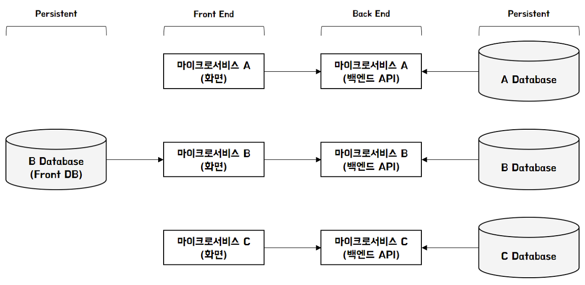

## backend의 분리와 msa로의 전환
1. MVC 모놀리식 아키텍쳐에서 front(view) - back - persistence 로의 분리
2. 서비스 단위 결정(Bounded Context을 통해) 
3. 서비스간 인터페이스 방식을 결정, 인터페이스를 위한 기술셋 선택

대략적인 형태를 보면 다음이다. 

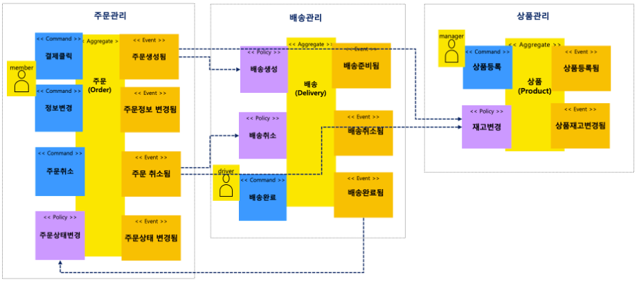

도메인을 통해 Bounded Context을 구분지어 서비스 단위를 설정한 뒤 서비스간 인터페이스로 통신을 하는
것을 살펴볼 수 있다.

어플리케이션 영역(화면, 백엔드)에서는 변화에 따라 대응 개발하기 용이하지만, 데이터의 재배치, 테이블의
재설계는 변화에 큰 영향을 주게 된다.

## DB가 분리된 마이크로서비스 vs 서비스만 분리된 마이크로서비스(통합 DB)
어플리케이션 아키텍처의 변화 

결국 동기화 처리의 싸움

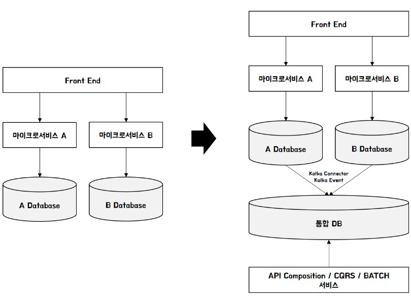

각 마이크로서비스 별로 독립적인 데이터베이스를 구성할 경우
* 조인쿼리 : 모놀리식 어플리케이션 내 조인쿼리에 대응하기 위한 동기/비동기 처리 호출 설계
* 트랜잭션관리 : 분산트랜잭션 관리를 위한 이벤트 처리 설계
* 보상트랜잭션 : 데이터 복구를 위한 Saga 패턴 설계
* API 증가 : 데이터 호출 증가에 따른 API 설계
* 배치 : 배치 아키텍처 설계를 위한 데이터 통합 방안 설계

단일데이터베이스 조인쿼리에 대해 API Composition, CQRS 테이블 생성, 보상 트랜잭션에 대한 설계 

이해의 핵심을 위해서 알아야할 것 동기/비동기 

### CQRS 란?
Command Query Responsibility Segregation 이다

명령(시스템 데이터 변경) 역할을 수행하는 구성 요소와 쿼리(시스템 데이터 조회) 역할을 수행하는 구성 요소를 나누는 것이
CQRS이다. 쉽게 말해 시스템 데이터를 변경하는 코드와 시스템 데이트를 조회하는 코드를 따로 만드는 것이다.

구현 방식이나 시스템 규모에 따라서 DB를 나누기도 하고 프로세스를 나누기도 했다.

간단한 예시를 살펴 보자
* MemberCommandApi : 명령을 위한 구성요소
  * 명령 상태를 변경하는 기능
* MemberQueryApi : Query를 위한 구성요소
  * 상태를 조회하는 기능

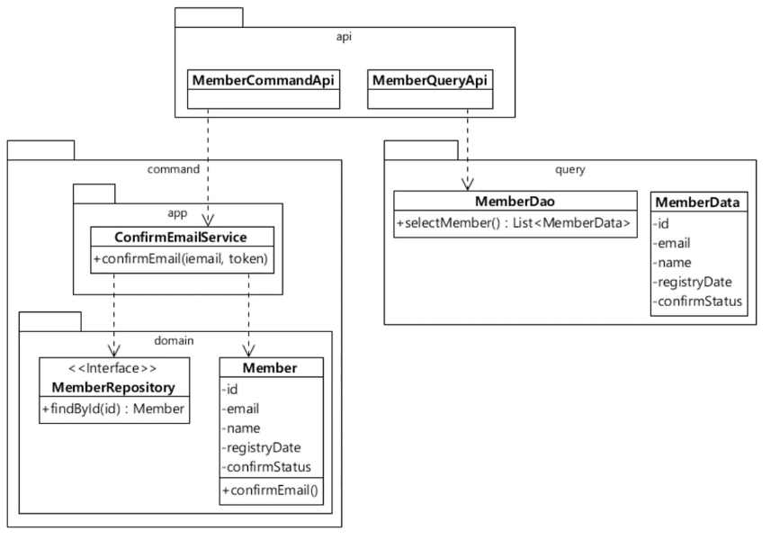

#### 명령과 쿼리는 다루는 데이터가 다르다.
복잡해지는 시스템에서 명령과 쿼리의 단일 모델을 구사하면 유지보수성이 떨어진다.

애초에 다루는 데이터가 다르다. JPA 기준으로 조회 api 는 수많은 DTO가 나오고, 결국 DB 단에서던 어플리케이션 단에서든
조회에 전혀 필요없는 컬럼들에 대해 가공을 해야 한다.

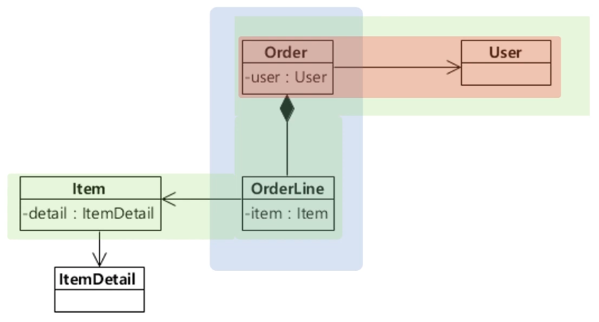

* 주문 취소같은 명령 기능은 Order, OrderLine 테이블만 다룬다
* 회원목록 조회, 주문목록 조회와 같은 쿼리 기능은 Order, User, Item 영역의 데이터를 다루어야 한다.
  * 회원의 비밀번호 생성 일자 관련된 내용은 Member 테이블에 존재하지만 조회 서비스에서 거의 쓰지 않을 내용이다.

#### 명령과 쿼리는 코드 변경 빈도가 다르다.
조회를 위해서 도메인에 변경사항을 추가해야 한다면, 기존 명령 기능 코드도 수정해야 할 가능성은 존재한다. 명령에 비해 조회기능은
변경사항이 많이 일어난다. 이는 곧 코드가 가지고 있는 책임의 크기가 적당하지 않다는 것이다(단일 책임 원칙을 따르지 못한다.)

#### 기능마다 성능 요구가 다르다.
기능마다 트래픽 패턴, 성능 요구가 다르다.

명령기능은 조회 기능에 비해 빠른 성능을 필요로 하지 않는다.

위와 같은 이유들로 명령과 쿼리를 위한 모델을 분리하자!

1. 명령영역의 모델과 쿼리영역의 모델이 무엇을 표현하고 있는지가 명확해짐
2. 전반적인 코드 가독성과 유지보수성이 좋아진다(결국 추상화를 한번 하는 것이 목표)
3. 쿼리 쪽은 캐쉬를 적용하고 명령 쪽은 비동기를 적용하는 식으로 기능에 따라서 성능향상 기법을 다르게 적용 할 수 있다.

### API Composition
특정서비스를 제공하는 녀석 A 존재한다고 가정, A, B, C, D 마이크로 서비스 존재 BCD의 제공 정보를 조합
클라이언트에게 최종적인 결과를 준다.

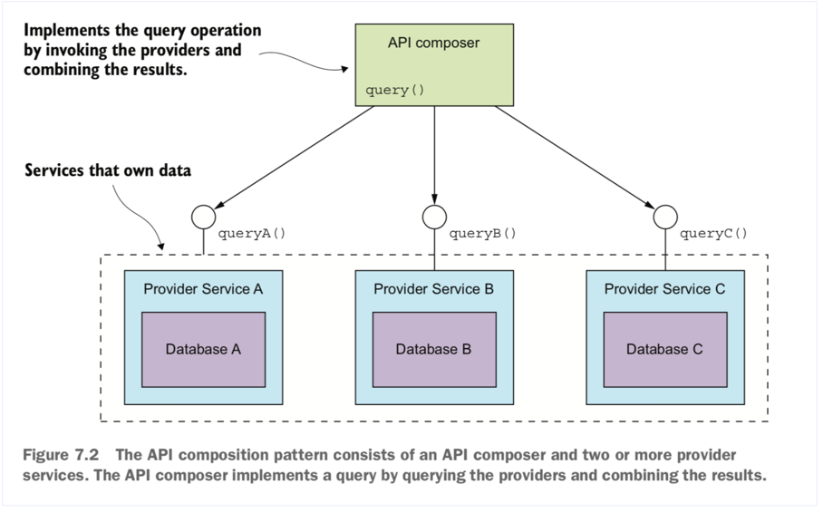

즉 service A,B,C 를 통해서 query를 통해 가져온 결과들을 조합, 조립 해주는 API composer가 존재
이렇게 각각의 결과들을 조립해주는 API Composer를 통해 각각의 서비스의 데이터들을 모아 클라이언트에게 제공
하는 방식을 API Composition 이라고 한다.

조합해야할 데이터가 많지 않다면 이 방법을 고려해 볼 수 있다.

하지만 여러 서비스들을 호출해서 조합을 할경우 좋지 않다 성능면에서 매우 나빠진다.

API Composer 는 결과적으로 메모리 상에서 각각의 결과들을 조합해야한다. 이는 규모가 커질 경우 부담으로 
다가오게 된다. 또한 각각의 서비스를 호출하는 부분에 있어서 만약 동기방식으로 만들어 졌다면 Delay가 발생
할 수도 있을 것이다. 각각의 서비스들로 보낸 요청이 잘왔는지 혹은 따로 검사해야봐야 할 조건들을 처리하는
로직들이 추가되어질 텐데 이러한 부분도 규모가 커지면 부담이다.

### 데이터 베이스의 분리
마이크로서비스에서 데이터베이스를 분리하기 위해서는 일반적으로 다음과 같은 고려사항 검토 해야한다.
* 데이터 동기화 문제
* 논리적 스키마 물리적 스키마 분해
* 트랜잭션 무결성
* 조인
* 대기 시간

다양한 분산 DB 설계를 알아보자

### 기존 legacy 단일 DB 패턴
먼저 단일 DB 환경은 기본적으로 동기 blocking 환경이라고 볼 수있다.

만일 단일 DB 형태로 마이크로 서비스를 적용시킨다면 여러 서비스 간 데이터 공존과 관련된 문제를 해소해야 한다.

개인적인 생각으로는 orm 만을 사용한다면 표준화가 되어있어 @Entity를 통해 어느정도 결합도가 분리된다고 생각하지만
하나의 프로젝트에서 결국 jdbcTemplate을 사용하게 될 경우 엔티티 이외의 테이블 혹은 column 에도 접근을 할
수 있기 때문에 궁극적으로 결합도를 줄이는 것은 아니다.

따라서 다음과 같은 문제가 발생한다,
* 마이크로서비스 간 정보 보호(은닉)의 어려움
* 데이터 통제의 어려움
* 결합도 증가에 따른 서비스 배포 독립성 확보 불가

### 분산 DB 환경에서 상호간 데이터 조회를 어떻게 효율적으로 관리 할 것인가?

#### 패턴 1. 마이크로서비스 간 독립 DB 사용

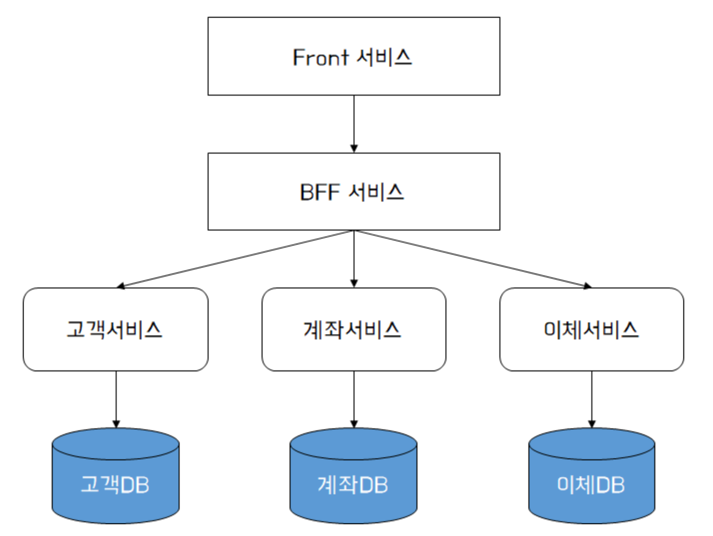

각 마이크로 서비스가 자체 데이터를 소유하고 비지니스를 서비스 내에서 처리할 수 있도록 데이터베이스를 분할
신규 서비스를 위와 같은 형태로 설계하는 것은 가장 바람직한 설계 방법. 하지만 현행 서비스가 존재하고
이를 마이크로서비스로 전환하는 경우 데이터의 결합도를 끊어 낼 수 있도록 완벽하게 설계하는 것은 굉장히 어렵다

여기서 나오는 BFF 서비스란 그냥 간단하게 여러 엔드포인트를 모아서(여기서는 고객, 계좌, 이체 서비스) 
하나의 api (데이터) 를 제공하는 서비스라고 생각하면 된다.

#### 패턴 2. 데이터 공유 방식(View)
완전한 분리가 불가능하다면, 차선으로 서비스당 2개 이상의 데이터베이스에 접근하는 방법
특히 서로 다른 서비스가 독립적인 DB를 가지고, 그 서비스간 데이터 조회를 고려해야 할 경우 테이블에 직접
접근 보다는 View 를 사용하여 결합도를 낮출 수 있다.

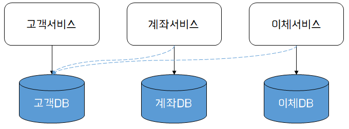

만일 위처럼 타 서비스의 데이터소스에 직접 접근하는 형태의 조회 방식이라면 공유하는 서비스간 결합도가 높아지는 문제가
발생 할 수 있다. 고객 서비스의 고객 DB가 변경될 경우 계좌 서비스와 이체서비스는 변경된 데이터 또는 스키마에 대한 검증을
함께 수행해야 한다.

그러므로 모든 외부 서비스를 위한 고객DB 전용 View 스키마를 만들고 외부 서비스가 고객 테이블이 아닌 고객 뷰테이블을 바라
보게 만든다.

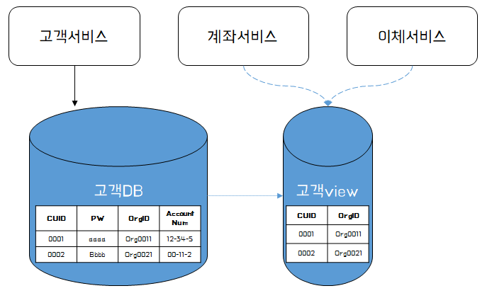

뷰를 어떤 방식으로 구성할 지에 따라 다르겠지만 (materialized view, 혹은 일반적인 view) materialized view의 경우
매번 고객 테이블에서 데이터를 직접 읽어서 연산을 할 일이 없으므로 성능이 향상 될 수 있다. 하지만 데이터 정합성 문제를
안고 가야하는 점은 잊지 말아야한다. 또한 데이터베이스에 직접 접근하는 방식보다는 접근 제어를 통해 결합도를 낮출 수 있지만
여전히 CUB와 R이 하나의 데이터 베이스 내에서 발생하기 때문에 최종 데이터베이스의 형태라고 볼 수 없다.

#### 패턴 3. 공통 마이크로서비스 활용
결국 중요한 점은 각 서비스가 명확히 자신의 데이터만을 관리하고 서비스 할 수 있다면 가장 좋은 설계이다. 결합도를 줄이기 위해
고객, 계좌, 이체 서비스에서 공통으로 사용될 서비스를 따로 빼고 그 공통서비스는 공통서비스 내 공통 DB에 저장하는 패턴 또한
고려해 볼 수 있다.

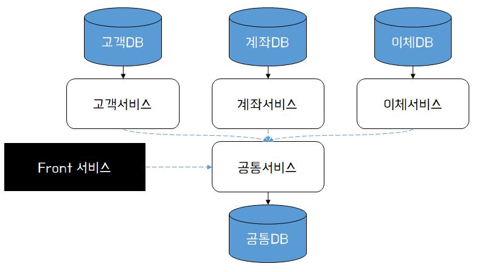

공통 서비스는 Front 서비스에게 공통 데이터를 직접 엑세스 할 엔드 포인트를 제공하고 마이크로서비스 간에는 공유 데이터 DB에
직접 접근하지 않고 공통서비스의 API를 호출하여 결과를 전달 받는다.

#### 패턴 4. ReadOnly DB 활용하기

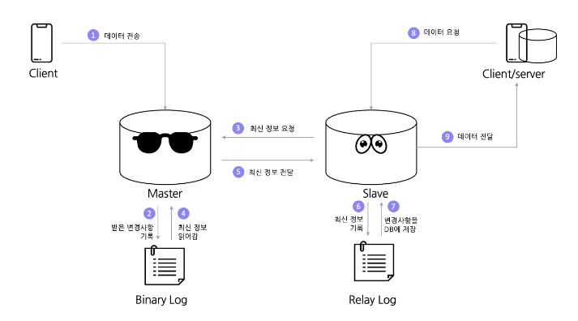

계좌서비스는 고객서비스에 데이터 변경을 위해 고객 API를 호출한다. 고객 DB에 변경된 데이터는 ReadOnly DB로 복제되며
고객서비스를 조회 할 경우 이 ReadOnly DB를 통해 접근 할 수 있다.

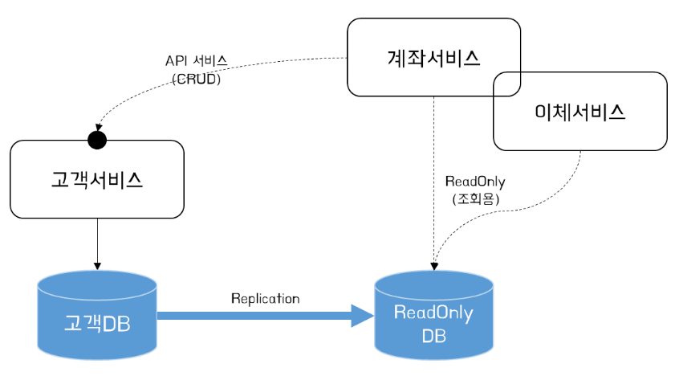

단 여기서 ReadOnly DB와 고객 DB의 타이밍 이슈로 인한 정합성을 고려해야 한다. 복제 방법은 DB에서 지원하는 
Replication 방식을 사용할 수도 있지만 CDC 도구를 사용하는 것이 안정적이다.

ReadOnly DB를 적용하면, 데이터를 보호하고, 읽기 전용 NoSQL DB를 활용하여 성능상 이점을 가져갈 수 있다. 
또한 분산 DB 데이터 관리 방안으로 CQRS나 API Composition 을 위한 조회 용도의 DB로 활용하기 좋다.

### 모놀리식 DB 에서 데이터 분할 하기
데이터베이스를 설계하는 핵심 포인트는 특정 데이터가 어느 분산 DB에 존재하는 것이 좋은지에 대한 결정을 내리는 일이다.
모놀리스에서 서비스를 분리할 때 일부 데이터는 함께 제공되어야하고 일부는 그대로 있어야 한다. 혹은 일부는 타 마이크로서비스로
이전 될 수 있다.

데이터베이스를 설계하는 핵심 포인트는 서비스간 호출 빈도를 줄일 수 있는 데이터 모델링이다.

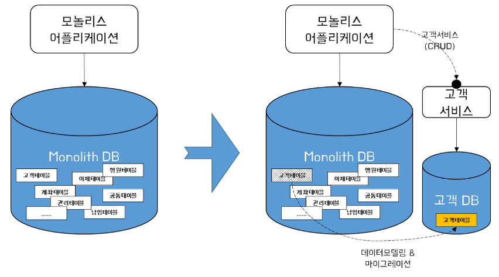

고객테이블을 모놀리식 DB에서 분리해 냈다고 해서 끝이 아니다. 일단 모놀리식 DB에서 외래키 제약조건을 고려해야 하며
분산트랜잭션 환경에 따른 데이터 정합성 관리 문제, 보상처리 설계 등 이슈들을 해소해야 테이블을 분할 할수 있게된다.

데이터 베이스간의 동기화 방법들을 알아보자.

이때 고객테이블은 고객서비스에서 전담을 한다고 생각했을 때 다양한 패턴을 생각해 볼 수 있다.
1. 고객 서비스에서 직접 양방향 쓰기 
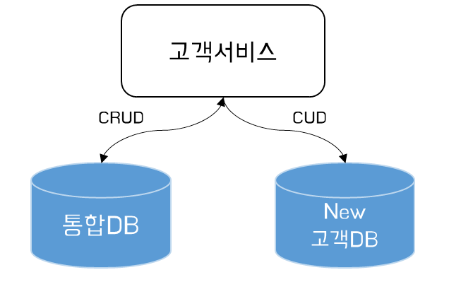

여기서 Read용 DB를 하나만 사용하여 다른쪽 db는 failover 용도로 사용 또한 가능하다. 

2. 단방향 쓰기후 CDC Tool 의 사용 
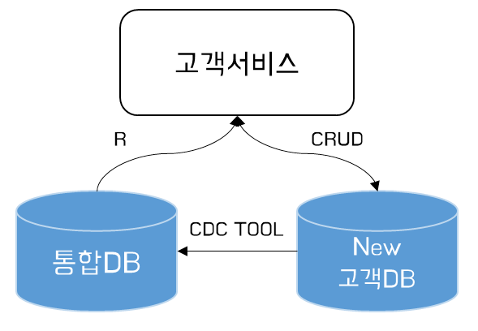

3. Full Mesh 방식 (모놀리스 서비스에서도 고객 테이블에 대한 CRUD를 사용) 각 데이터베이스 동기화는 CDC Tool 사용 
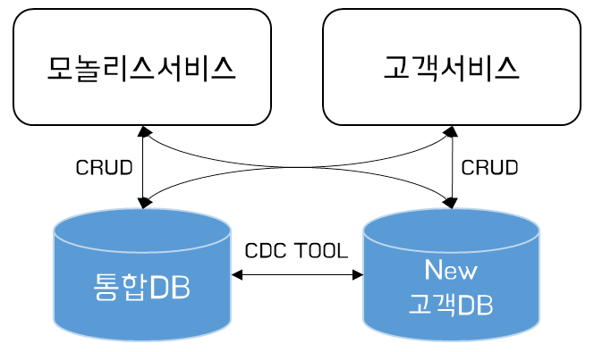

## 어떻게 데이터베이스를 분리할 것인가?

### 논리적 분리 vs 물리적 분리
단일 데이터 베이스에서 서비스별 다른 스키마 가지기

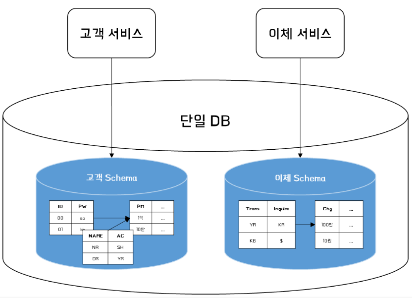

다른 데이터베이스 엔진에 각 논리적 스키마 가지기

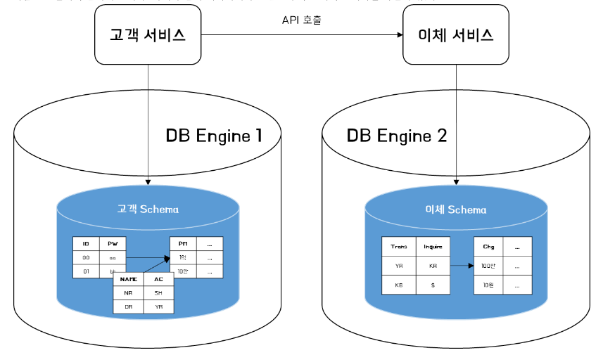

* 논리적 분리
  * 엔진에 대한 독립적인 변경이 어렵고 정보 은닉을 허용한다.
  * 단일 장애 지점이 발생 할 수 있다. 데이터베이스 엔진이 중단되면 두서비스 모두에 영향을 미친다.
  * 장애를 방지하기 위하여 HA 시스템을 잘 구축해야하고 복원력이 뛰어난 데이터베이스 클러스터를 구성해야한다.

* 물리적 분리
  * 논리적 분리의 장점 + 시스템 견고성을 개선하고 리소스 경합을 제거하여 처리량이나 지연 시간을 개선할 수 있다.
  * 단일 장애 지점이 방지 된다.
  * 하지만 지속적으로 증가하는 비용, 유지보수를 감당해야한다.

### 분리 과정
데이터 베이스를 최종적으로 논리적으로 분리하게 만들기 위해서 다음과 같은 접근 방식을 생각 할 수 있다.
1. 데이터베이스를 분리한 후 코드를 분할
2. 코드를 분리한 후 데이터베이스 분할
3. 한 번에 분할

### 데이터 베이스를 우선으로 분리
비지니스 단위 별 별도의 스키마를 사용하면 단일 작업을 수행하기 위한 데이터베이스 호출 수가 늘어 나게 된다.
이전에는 단일 select 문에서 join 을 통해 원하는 데이터를 가질 수 있었지만 이제는 두 위치에서 데이터를 다시 가져와
메모리에 결합해야 할 수 있다. 또한 두개의 스키마로 이동할 때 트랜잭션 무결성이 깨지기 때문에 어플리케이션에 상당한 영향을
미칠 수 있다.

1. Bounded Context 단위의 repo

흔히 도메인 단위로 레이어드 계층을 만든다고 생각 하면 편하다. 그림은 다음과 같다.

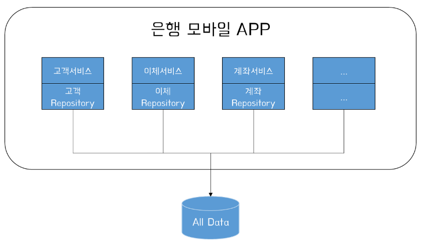

DDD모델의 Context, 모델간의 경계를 Bounded Context라고 하며, 하나의 도메인 안에는 여러 Context가 존재할 수도 있고
여러 도메인에 걸처 하나의 Context가 생성될 수도 있다. 이와 같은 경계는 데이터를 분리하는 기준이 되며, 나아가 마이크로서비스를
구분하는 기준이 되기도 한다.

2. Bounded Context 단위의 데이터 베이스

마이크로서비스의 독립적인 배포는 자체 데이터를 소유해야 가능하며 어플리케이션 코드를 분리하기 전에 식별된 Bounded Context
를 중심으로 데이터베이스를 명확하게 분리하여 이 분해를 시작 할 수있다.

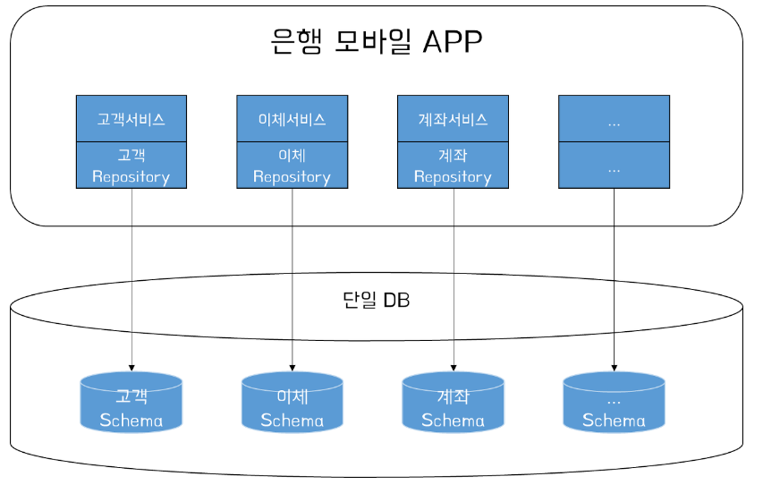

각 Bounded Context에는 자체 데이터베이스 스키마가 존재한다. 나중에 마이크로서비스로 분리해야 하는 경우 손쉽게 전환해
나갈 수 있는 형태를 마련하게 된다.

### 코드를 우선으로 분리

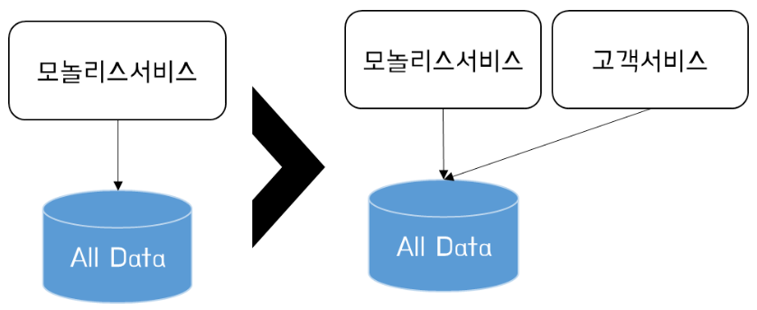

어플리케이션 계층으로 분할 하면 새 서비스에 필요한 데이터를 훨씬 쉽게 이해 할 수 있게 된다. 또한 독립적으로 배포할 수 있는
구조를 더 일찍 확보할 수 있는 이점을 얻을 수 있다.

1. 모놀리스 API SERVER

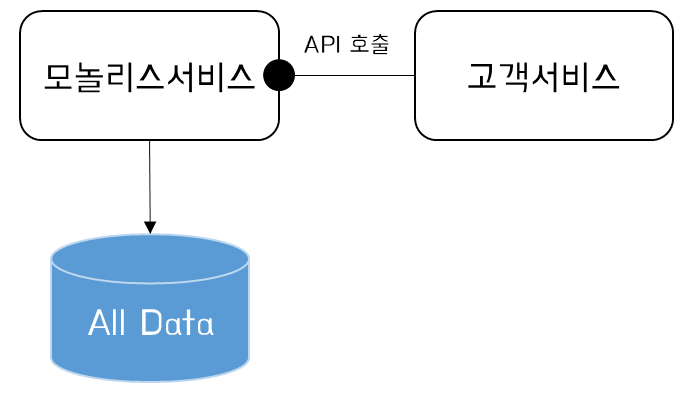

모놀리스 데이터에 직접 액세스하는 대신 모놀리스 서비스에 API를 생성하는 형태를 고려해 볼 수 있다. 
아래와 같이 고객서비스는 고객 정보에 액세스할 수 있도록 모놀리스 서비스에 API를 만든다.

후에 계속해서 계좌서비스로 분리가 되면 다음과 같은 형태가 되겠다.

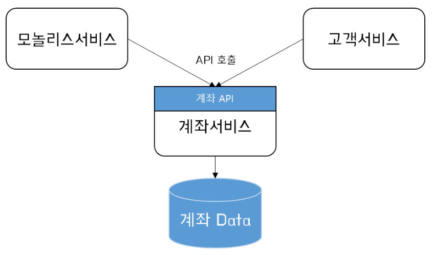

2. 다중 스키마 스토리지

모놀리스 서비스와 고객 서비스 간 종존하는 데이터에 대해 항상 모든 데이터가 동기화 되어야 하는 것은 아니다.
